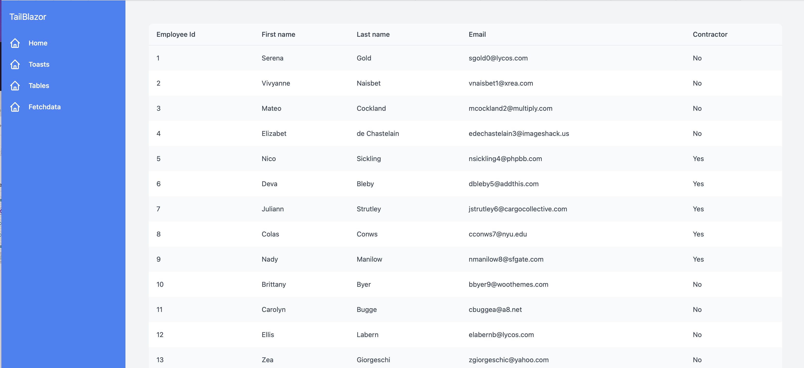

# TailBlazor.Table

Blazor Table a basic yet customizable table component for Tailwindcss

Without passing it anything you'll get very basic styles, however giving it it's base classes and you can really make a customizable table that Tailwind is capable of.




## Getting Setup

You can install the package via the NuGet package manager just search for TailBlazor.Table. You can also install via powershell using the following command.

`Install-Package TailBlazor.Table`

Or via the dotnet CLI.

`dotnet add package TailBlazor.Table`

### 1. Add Imports

Add line to your \_Imports.razor

```
@using TailBlazor.Table
```

### 3. Create Table Component

Inside your page create your table component with the basic format below. For table styles, use the `TableClass` parameter

```
<TailBlazorTableTemplate TableClass="divide-gray-200">
    <TableHeader>
        ...
    </TableHeader>
    <RowTemplate>
        ...
    </RowTemplate>
</TailBlazorTableTemplate>
```

#### 4. Adding the table headers

for each table header add it's own `<th></th>` with optional styles.

You can also configure the thead styles using the `HeaderClass' parameter on the parent table component.

```
<TailBlazorTableTemplate HeaderClass="bg-gray-50">
    <TableHeader>
        <th class="px-4 py-3 text-left text-sm font-medium text-gray-700">Employee Id</th>
        <th class="px-4 py-3 text-left text-sm font-medium text-gray-700">First name</th>
        <th class="px-4 py-3 text-left text-sm font-medium text-gray-700">Last name</th>
        <th class="px-4 py-3 text-left text-sm font-medium text-gray-700">Email</th>
        <th class="px-4 py-3 text-left text-sm font-medium text-gray-700">Contractor</th>
    </TableHeader>
    ...
```

#### 5. Creating your model

To get your `context` you'll have to add the `Items` which is an IEnumerable<TItem>. You'll want to have the class you want to pass in inherit the `ITailBlazorTableModel`.

```
public class MyClass : ITailBlazorTableModel
{
    ...
}
```

You'll need to implement the classes. For the `ShowChildTemplate`. This allows you to show an additional row on some sort of trigger. More about in #7.

By default your object is accessible via the `context` parameter. You can however rename that via `Context=NewContextName`. Type inference is great but sometimes it doesn't quite get it right. You may also need to pass the table the type `TItem=YourClass`.

You can also like above, pass the table component your body styles like so `BodyClass="bg-blue-400"`

```
<TailBlazorTableTemplate Context="NewContextName" TItem=YourClass Items=youClassList>
...
 <RowTemplate>
    <td class="text-gray-700">@NewContextName.Id</td>
    <td class="text-gray-700">@NewContextName.FirstName</td>
    <td class="text-gray-700">@NewContextName.LastName</td>
    <td class="text-gray-700">@NewContextName.Email</td>
    <td class="text-gray-700">@(NewContextName.IsContractor ? "Yes" : "No")</td>
</RowTemplate>
...
```

### 6. More Customization

By default the table is striped. You can disable that by setting `StripeRows=false` inside the Table component

```
<TailBlazorTableTemplate StripeRows=false>
```

### 7. ChildRow

If you have a row that should expand when a user triggers a button. You have access to the `<ChildTemplate></ChildTemplate>` RenderFragment. Setting `ShowChildTemplate` inside your RowTemplate will show the new table row.

Treat the ChildTemplate the same as RowTemplate created just under the activated row.

Note: There isn't just a property called "ShowChildTemplate". We're assuming this is a bool from a DB or something. If you don't have that it could be as simple as assigning a property to false and then assigning that property to the `ShowChildTemplate` method you implemented above.

```
public class MyClass : ITailBlazorTableModel
{
    ...
    
    public bool ShowChildTemplate {
        get {
            return ShowChildTemplate;
        }
    }

    public bool ShowChildTemplate { get; set; } = false;

    ...
}

```


```
<RowTemplate>
    ...
    <td>
        <a href="" @onclick="e => NewContextName.ShowChildTemplate = !NewContextName.ShowChildTemplate">Open ChildTemplate</a>
    </td>
</RowTemplate>
 <ChildTemplate>
    <button>Activate Launch Sequence?</button>
</ChildTemplate>
```